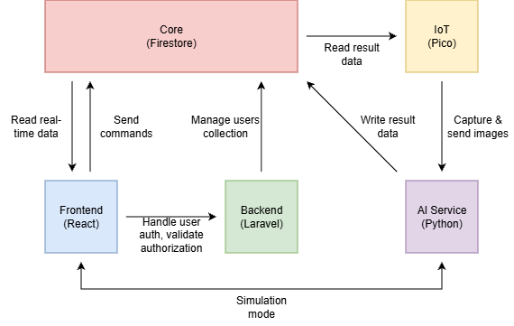

# SIGMA  
**Smart Integrated Governance for Mobility Analytics**

SIGMA is a web-based software platform developed to support our **Integrated Traffic Control System (ITCS)** project.  
It serves as an operational dashboard for traffic monitoring, system control, and administrative management.

---

## 📌 Overview

SIGMA is designed for two primary roles:

- **ITCS Operators**  
  Monitor traffic conditions and control intersections in real time.

- **Super Administrators**  
  Manage operator and administrator accounts and oversee system access.

The system integrates real-time data processing, AI-based traffic analysis, and centralized control to support smarter traffic governance.

---

## 🖼️ System Architecture

> The diagram above illustrates the interaction between the frontend dashboard, backend services, AI processing, database core, and IoT devices.

---

## 🧠 Core Capabilities (High-Level)

- Live traffic monitoring from instrumented intersections  
- Manual override of traffic light behavior  
- Isolated traffic simulation mode  
- Role-based access control and account management  

> Detailed functional and technical documentation is provided separately.

---

## 📄 Full Documentation

For complete system design, feature breakdowns, and development details, please refer to the full documentation:

👉 **[SIGMA Full Documentation (Google Docs)](https://docs.google.com/document/d/1mHJaIazIJGKJBCxiB-aZPNpBlzWTZq0yo39ck6yySfc/edit?usp=sharing)**

---

## 🛠️ Technology Stack

- **Frontend:** React  
- **Backend:** Laravel  
- **AI Service:** Python (YOLO, fuzzy logic)  
- **Database Core:** Firebase Firestore  
- **IoT:** Raspberry Pi Pico  

---

## 👥 Development Team

- **Irvino Kent** — Firestore core, Laravel backend, Python AI service  
- **Michael Ivan** — React frontend  
- **Gregorius Darrel** — IoT (Pico)

---

## 📌 Notes

Some features require direct collaboration with transportation authorities and may currently be implemented as mockups or simulations.

---

## 📜 License

This project is developed as part of the ITCS Corecept initiative.
